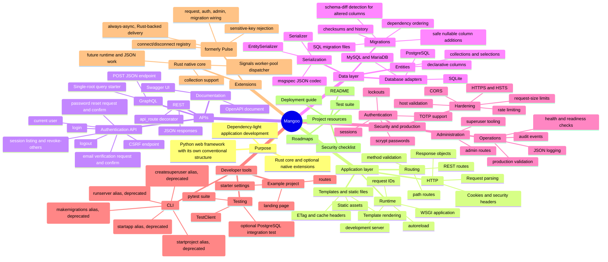

# Mangoo project mind map

```mermaid
mindmap
  root((Mangoo))
    Purpose
      Python web framework with its own conventional structure
      Rust core and optional native extensions
      Dependency-light application development
    Application layer
      Routing
        path routes
        method validation
        REST routes
      Runtime
        WSGI application
        development server
        autoreload
        request IDs
      HTTP
        Request parsing
        Response objects
        Cookies and security headers
      Templates and static files
        Template rendering
        Static assets
        ETag and cache headers
    APIs
      REST
        api_route decorator
        JSON responses
      GraphQL
        Single-root query starter
        POST JSON endpoint
      Documentation
        OpenAPI document
        Swagger UI
      Authentication API
        login
        current user
        logout
        CSRF endpoint
        password reset request and confirm
        email verification request and confirm
        session listing and revoke-others
    Data layer
      Entities
        declarative columns
        collections and selections
      Database adapters
        SQLite
        PostgreSQL
        MySQL and MariaDB
      Migrations
        SQL migration files
        checksums and history
        dependency ordering
        safe nullable column additions
        schema-diff detection for altered columns
      Serialization
        Serializer
        EntitySerializer
        msgspec JSON codec
    Security and production
      Authentication
        scrypt passwords
        sessions
        TOTP support
        lockouts
      Hardening
        host validation
        CORS
        HTTPS and HSTS
        rate limiting
        request-size limits
      Operations
        JSON logging
        audit events
        health and readiness checks
        production validation
      Administration
        superuser tooling
        admin routes
    Developer tools
      CLI
        newproject (startproject alias, deprecated)
        newapp (startapp alias, deprecated)
        launch (runserver alias, deprecated)
        newmigration (makemigrations alias, deprecated)
        createadmin (createsuperuser alias, deprecated)
      Testing
        TestClient
        pytest suite
        optional PostgreSQL integration test
      Example project
        starter settings
        routes
        landing page
    Extensions
      Signals event bus addon (formerly Pulse)
        connect/disconnect registry
        always-async, Rust-backed delivery
        sensitive-key rejection
        request, auth, admin, migration wiring
      Rust native core
        collection support
        Signals worker-pool dispatcher
        future runtime and JSON work
    Project resources
      README
      Deployment guide
      Security checklist
      Roadmaps
      Test suite
```
